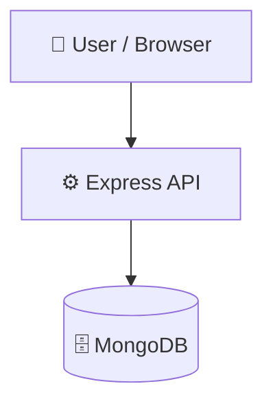

# Mentorship-Platform

          

## 📑 Table of Contents

- [📝 Description](#description)
- [📸 Screenshots](#-screenshots)
- [🛠️ Tech Stack](#️-tech-stack)
- [🏗️ Architecture](#️-architecture)
- [⚡ Quick Start](#-quick-start)
- [📦 Key Dependencies](#-key-dependencies)
- [🚀 Available Scripts](#-available-scripts)
- [🌐 API Endpoints](#-api-endpoints)
- [📁 Project Structure](#-project-structure)
- [🛠️ Development Setup](#️-development-setup)
- [👥 Contributors](#-contributors)
- [🤝 Contributing](#-contributing)
- [📜 License](#-license)

## 📝 Description

Mentorship-Platform — a backend api built with Express.js, JavaScript, MongoDB, Vite.

## 📸 Screenshots


## 🛠️ Tech Stack

- 🚀 **Express.js**
- 🟨 **JavaScript**
- 🍃 **MongoDB**
- ⚡ **Vite**

**Notable libraries:** Mongoose

## 🏗️ Architecture

A high-level view of how the main pieces fit together:



## ⚡ Quick Start

```bash

# 1. Clone the repository
git clone https://github.com/OmarAliSiad/Mentorship-Platform.git

# 2. Install dependencies
npm install

# 3. Start the dev server
npm run dev
```

## 📦 Key Dependencies

```
bcryptjs: ^3.0.3
cors: ^2.8.6
dotenv: ^17.4.2
express: ^5.2.1
jsonwebtoken: ^9.0.3
mongoose: ^9.7.0
```

## 🚀 Available Scripts

- **dev** — `npm run dev`

## 🌐 API Endpoints

Detected endpoints (best-effort scan):

```
GET /api/health
```

## 📁 Project Structure

```
.
├── Backend
│   ├── package.json
│   ├── server.js
│   └── src
│       ├── config
│       │   └── db.js
│       ├── controllers
│       │   ├── authController.js
│       │   ├── mentorController.js
│       │   └── studentController.js
│       ├── middleware
│       │   └── authMiddleware.js
│       ├── models
│       │   ├── MentorAvailability.js
│       │   ├── MentorProfile.js
│       │   ├── Session.js
│       │   ├── Stack.js
│       │   └── User.js
│       └── routes
│           ├── adminRoutes.js
│           ├── authRoutes.js
│           ├── mentorRoutes.js
│           ├── stackRoutes.js
│           └── studentRoutes.js
├── design.md
├── frontend
│   ├── components.json
│   ├── eslint.config.js
│   ├── index.html
│   ├── jsconfig.json
│   ├── package.json
│   ├── src
│   │   ├── App.jsx
│   │   ├── assets
│   │   │   └── images
│   │   │       ├── admin_dashboard.png
│   │   │       ├── admin_stacks.png
│   │   │       ├── admin_statistics.png
│   │   │       ├── admin_users.png
│   │   │       ├── mentorship_dashboard.png
│   │   │       ├── mentorship_history.png
│   │   │       ├── mentorship_mentor.png
│   │   │       └── students_dashboard.png
│   │   ├── components
│   │   │   └── ui
│   │   │       ├── button.jsx
│   │   │       ├── pagination.jsx
│   │   │       ├── select.jsx
│   │   │       ├── skeleton.jsx
│   │   │       └── sonner.jsx
│   │   ├── index.css
│   │   ├── layouts
│   │   │   ├── FloatingNav.jsx
│   │   │   ├── MinimalistFooter.jsx
│   │   │   └── PublicLayout.jsx
│   │   ├── lib
│   │   │   └── utils.js
│   │   ├── main.jsx
│   │   ├── pages
│   │   │   ├── AdminDashboard.jsx
│   │   │   ├── AuthPage.jsx
│   │   │   ├── LandingPage.jsx
│   │   │   ├── MentorDashboard.jsx
│   │   │   ├── MentorProfile.jsx
│   │   │   ├── MentorSearch.jsx
│   │   │   ├── NotFound.jsx
│   │   │   └── StudentDashboard.jsx
│   │   └── store
│   │       ├── authStore.js
│   │       └── themeStore.js
│   └── vite.config.js
├── overview.md
└── prd.md
```

## 🛠️ Development Setup

### Node.js / JavaScript
1. Install Node.js (v18+ recommended)
2. Install dependencies: `npm install` (or `yarn` / `pnpm install` / `bun install`)
3. Start the dev server: see the **Quick Start** above

## 👥 Contributors

Thanks to everyone who has contributed to this project:

<p align="left">
<a href="https://github.com/mohamedahmed-dev" title="mohamedahmed-dev"></a>
<a href="https://github.com/OmarAliSiad" title="OmarAliSiad"></a>
<a href="https://github.com/ahmed-azab271" title="ahmed-azab271"></a>
<a href="https://github.com/Ramadan-Elgamal" title="Ramadan-Elgamal"></a>
</p>

[See the full list of contributors →](https://github.com/OmarAliSiad/Mentorship-Platform/graphs/contributors)

## 👥 Contributing

Contributions are welcome! Here's the standard flow:

1. **Fork** the repository
2. **Clone** your fork: `git clone https://github.com/OmarAliSiad/Mentorship-Platform.git`
3. **Branch**: `git checkout -b feature/your-feature`
4. **Commit**: `git commit -m 'feat: add some feature'`
5. **Push**: `git push origin feature/your-feature`
6. **Open** a pull request

Please follow the existing code style and include tests for new behavior where applicable.

## 📜 License

This project is licensed under the **ISC** License.

---
*This README was generated with ❤️ by [ReadmeBuddy](https://readmebuddy.com)*
